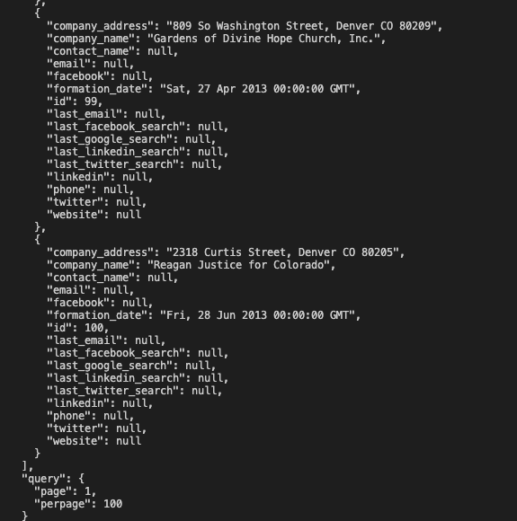
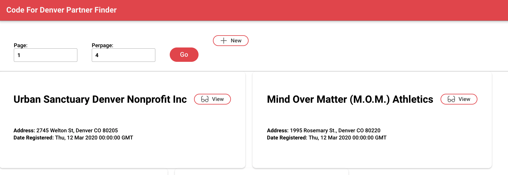

A micro-CRM to help Code For Denver discover leads and manage its outreach to potential partners.

# Data Sources For Leads
- [Socrata API](https://data.colorado.gov/Business/Business-Entities-in-Colorado/4ykn-tg5h)
    - Dataset with registered business entities in Colorado. It can be filtered to return only nonprofits.
- [Colorado Nonprofit Association](https://coloradononprofits.org/membership/nonprofit-member-directory)
    - Website with nonprofit members registered with Colorado Nonprofit Association.
- Twitter?
- LinkedIn?


# Getting Started
## Get the Code
1. Go to the project's [github page](https://github.com/codefordenver/partner-finder).
1. Find the green "Code" button
1. Click the clipboard icon to copy a link to the git repo.
    
1. In a terminal, navigate to the directory where you want to create the project folder and clone the repo:
    ```bash
    git clone <git-repo-name>
    ```
## Running the Backend locally
1. Install Docker and Docker-compose
1. Run the backend
    ```bash
    docker-compose up --build -d
    ```
1. Check the containers are running
    ```bash
    docker ps
    ```
    - you should see something like
        
1. Check that the api works
    - http://localhost:8000/leads
    - or do it the hard way:
        ```bash
        curl http://localhost:8000/leads
        ```
    - either way, you should see a bunch of json displayed
        
## Running the Frontend locally
1. Start a new terminal
1. Move to the project root directory
1. Change to the frontend folder
    ```bash
    cd ./frontend/cfd-partner-finder
    ```
1. Create a file called `.env` the following contents:
    ```bash
    export REACT_APP_BACKEND_HOST="http://localhost:8000"
    ```
1. Install dependencies
    ```
    npm install
    ```
1. Run the app on localhost
    ```
    npm start
    ```
1. A browser should open with the app running. It looks like this (for now)
    
    - If no browser opens, go to http://localhost:3000

## Running a data analysis jupyter notebook (Optional)
1. Make sure python 3 is installed on your system
1. from the project root directory, change to the data analysis directory
    - `cd ./data_analysis`
1. Create a virtual environment
    ```python
    python3 -m venv --prompt data_analysis venv
    ```
    - You should see a newly created folder called `venv`
1. Activate the virtual environment
    ```bash
    source venv/bin/activate
    ```
    - Your terminal prompt should change to display `(data_analysis)` on the left while the virtual environment is active.
1. Upgrade the virtual environment's installation of pip
    - `pip install --upgrade pip`
1. Install dependencies
    - `pip install -r requirements.txt`
1. Run a jupyter server:
    ```
    jupyter notebook
    ```
1. You should see a file system open in a web browser. If not, go to http://localhost:8888/tree
    
1. Click on `notebooks`, and then `businesses.ipynb`. You should now see a notebook
    
1. When you are done, stop the jupyter server with `Ctrl+C` and deactivate the virtual environment with `deactivate`.
